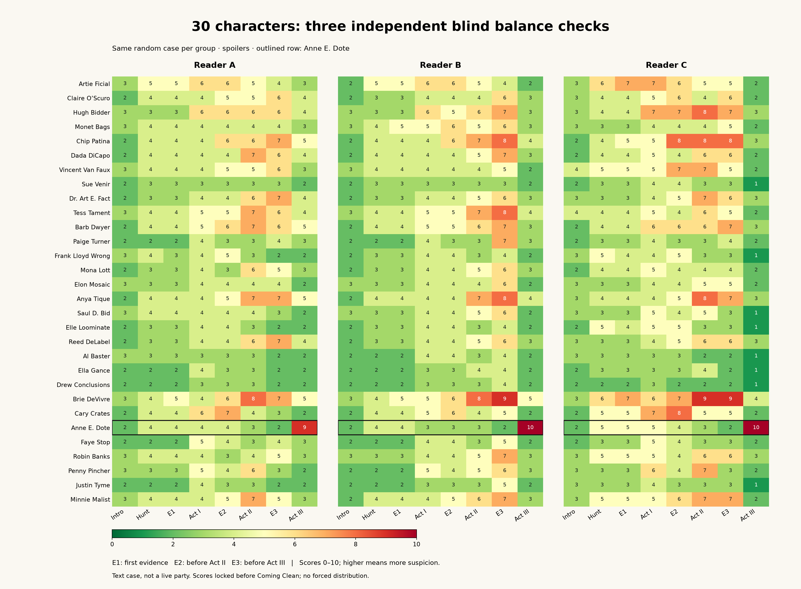
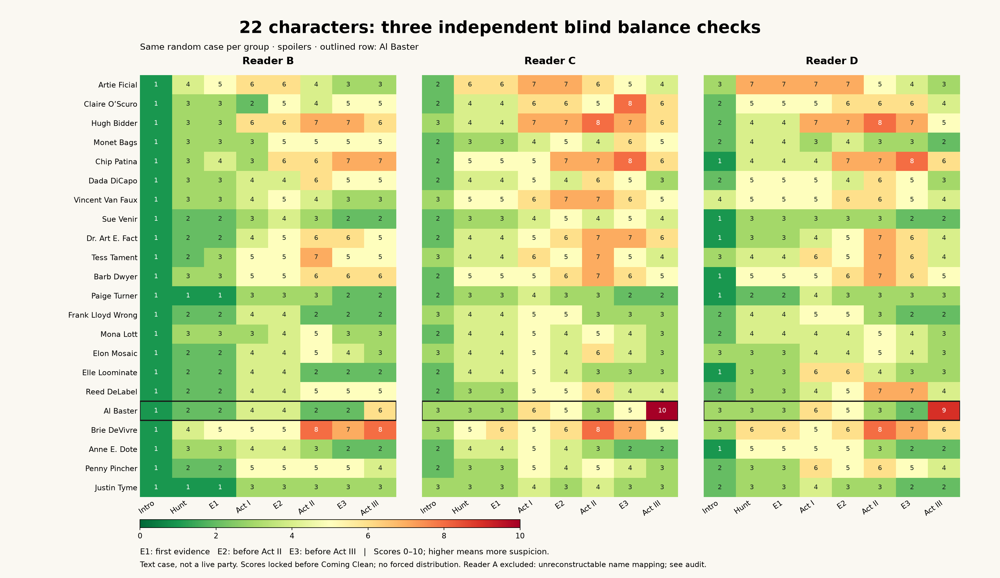

# Dramatic writing revision: six valid blind checks

October 10, 2026. **Spoilers throughout, including both selected murderers.**

Five of six readers selected the murderer at the end, with no obvious murderer reported before Act III. Four maintained the requested midpoint breadth; two met every numeric target. The personal details improve several scenes, but repeated speech and resolution structures remain visible. This candidate is not accepted for publication.

## Method and integrity

The completed dramatic revision was frozen without further story changes. One random murderer was drawn for all30 characters: **Anne E. Dote**. A second random murderer was drawn from the locked22 RSVP roles, excluding the first selection to ensure a different case: **Al Baster**. Draws used SystemRandom; neither case was rerolled after seeing results. Three fresh readers assessed each case independently, without conversation history, branch labels, author files, targets, other readers or prior scores. Each saved eight sequential snapshots before reading the next release. Only the selected character's murderer branch was shown; all others received innocent branches.

Stages: introductions → all16 hunt envelopes → first evidence → Act I statements → second evidence → Act II statements → third evidence → Act III statements. Accusations and initial feedback were saved before Coming Clean. All selected endings were then reviewed for narrative payoff; this is broader than the actual party's top-voted-suspect finale. Innocent statements were not introduced as a truth axiom.

**One invalid attempt is preserved rather than repaired.** Original RSVP Reader A used positional arrays that assigned its intended final Al9 to Reed. Its surviving pre-reveal notes establish only that one intended score, not Reed's intended score or a reliable mapping for earlier stages. The entire numeric reading is excluded. [Raw original](balance-dramatic-22-01/reader_a.json) and [clerical audit](balance-dramatic-22-01/reader_a_audit.md) remain unchanged. A fresh replacement, Reader D, read the identical frozen case. The three valid RSVP checks are B/C/D. Reader B's genuinely incorrect accusation is retained; it was not a clerical error.

The report script checks all input hashes, post-vote hashes, exact character sets, score bounds, eight-stage coverage and presence of both feedback phases. **1,248 valid score entries** across48 checkpoints. Plot ranges are fixed0–10, with no averaging or forced distribution. Both combined heatmaps were rendered and visually inspected.

## Results

Midpoint target: at least10/30 or8/22 scores **strictly above5** after Act II. Desired ending: correct leader, no early obvious culprit, and3–4 alternative suspects at5–6. Counts at6–7 are also reported to capture the user's preference for stronger lingering doubt.

| Cast / reader | Act II above5 | Murderer final | Final leader | Other final5–6 | Other final6–7 | All numeric targets |
|---|---:|---:|---|---:|---:|---|
|30 A|12|Anne9|Anne|4|0|Yes|
|30 B|7|Anne10|Anne|1|0|No|
|30 C|13|Anne10|Anne|0|0|No|
|22 B|7|Al6|Brie8|8|3|No|
|22 C|11|Al10|Al|8|4|No|
|22 D|11|Al9|Al|4|2|Yes|

Every correct final choice first becomes an explicitly obvious culprit at checkpoint8, after Act III statements. No reader gives the selected murderer an early sole lead of at least8 with a margin of at least2 before Act III. These measures capture the desired timing in the tested cases, not universal impossibility of an early human guess.

Full30 consistently identifies Anne, but two readers discard almost every alternative at the end. RSVP22 leaves more uncertainty: B sees Brie as the stronger direct-contact suspect and rates Al's false explanation insufficient to establish murder. C and D instead treat Al's incompatible material claim as decisive. This disagreement exposes a specific distinction between demonstrating a false account and supporting a physical crime route.

### All30: Anne selected

[Detailed feedback](balance-dramatic-30-01/RESULTS.md) · [Scores CSV](balance-dramatic-30-01/scores.csv) · [PDF heatmap](balance-dramatic-30-01/three_reader_heatmap.pdf) · [Frozen protocol](balance-dramatic-30-01/PROTOCOL.md)

### RSVP22: Al selected

[Detailed feedback](balance-dramatic-22-01/RESULTS.md) · [Scores CSV](balance-dramatic-22-01/scores.csv) · [PDF heatmap](balance-dramatic-22-01/three_reader_heatmap.pdf) · [Frozen protocol](balance-dramatic-22-01/PROTOCOL.md)

## What the writing feedback establishes

**Specific human details work.** Readers singled out Tess's fixation on the glass she bought, Monet still calculating wages, Al's obligation to the person at home, Faye's ordinary photographic direction, Barb wishing she had footage, Anya's old key, and Artie's compulsive hosting. These give different meanings to the same death. In the endings, Sue/Mona choosing friendship, Dada refusing to make immediate art from trauma, Tess being left with an argument Grant cannot answer, and Reed/Claire establishing a boundary were stronger than exhibit summaries. Preserve these beats.

**Different vocabulary is not enough.** Multiple readers still recognized the repeated sequence: disclose a mistake, explain the evidence, name a colleague, articulate a polished emotional insight. People under pressure sound too equally articulate and self-aware. Terse, evasive, angry or selfish responses are needed as scene forms, not just adjectives in the voice bible. Do not make everyone summarize their arc.

**The scandal architecture remains repetitive.** New family and emotional stakes sit on top of too many altered-record, withheld-information and corrected-record stories. Refunds, credits, settlement receipts and tidy promises recur in Coming Clean. Several readers also find preview attendance and drink-adjacent opportunities arranged. The revision has softened the repetition; it has not solved it.

**Characters still interpret the puzzle.** Method speeches frequently explain why a substance, source or document differs from the forensic item. That can preserve factual truth while sounding like an author answering a worksheet. Readers should make the comparison themselves. Keep the necessary observation or action; remove the speaker's conclusion about its evidentiary meaning.

**Selected lies and motives need care.** Anne's false group-tour claim and Al's false metal-leaf explanation stand out amid many neat, correct explanations. This creates late identification but also reveals the construction. Anne's continuing motive feels weak when school places were already funded; establish what Grant could still destroy rather than relying on exposure of a promise whose practical problem is solved. Al's caregiver consequence is moving, but his actual bottle/glass route is much clearer in the confession than before voting.

**Finale review found world-context problems.** In the Anne-selected case, Robin and Justin's innocent endings assume Anne is available for future work after her confession. Since any eligible role may be selected, cooperative future plans cannot depend on another character remaining innocent. No new clue should be inserted into Coming Clean to repair a deduction that was unavailable at voting.

## Prior results and limits of comparison

| Trial | Cast / culprit | Act II above5 | Final culprit scores | Other final5–6 |
|---|---|---|---|---|
|Previous full04|30 / Hugh|6,8,9|9,9,9|0,8,1|
|Current dramatic30|30 / Anne|12,7,13|9,10,10|4,1,0|
|Current dramatic22|22 / Al|7,11,11|6,10,9|8,8,4|

These observations do not establish a controlled positive trend: selected murderer, cast and readers differ. Full04 also records one persistence deviation. The current matching-Hugh export remains unscored. Current midpoint breadth is encouraging in four readers, while final ambiguity remains uneven and the qualitative repetition persists. Do not claim the prose revision preserved every prior ranking or that five correct model accusations predict a human success rate. Only two of thirty eligible selected worlds were tested here; artwork comprehension, printed layout and live pacing were not tested.

## Actionable next pass, in priority order

1. **Protect the information schedule before touching prose.** Record each tested role's incriminating fact, innocent counterfact, selected false claim and reveal stage. Keep those facts and their release timing unchanged in the first writing pass. Separate any proposed evidentiary change into its own explicit design decision. Do not chase the desired colors by multiplying bottle handling, adding precise synchronized alibis or making every innocent's evidence weaker.
2. **Repair the two specific story gaps with minimal causal work.** Clarify Anne's remaining personal stake before voting. Audit what the Al case actually supports before the confession: access, opportunity, false material claim, and alternatives such as Brie. If access needs another fact, reuse an ordinary event already in the story where possible; do not invent another drink-area errand for the whole cast. A false explanation may remain circumstantial, but the report must distinguish that from a proven transfer. Assess whether the same gap exists in other selected routes before extending the repair.
3. **Break the speech shapes, character by character.** Review all30 across three rounds and finale as conversations under pressure. Assign different responses: a short refusal, a rambling grief response, an accusation, a practical demand, an unfinished answer, an angry admission, an unrepentant choice. Remove the universal colleague-name-and-insightful-coda ending. Preserve factual branch distinctions; changing emotional delivery must not quietly add a false innocent fact or disclose a new alibi early.
4. **Remove interpretation while retaining observable facts.** In Method and Coming Clean, mark sentences that compare exhibits or announce exoneration. Replace only their commentary with the speaker's concrete memory/action or reaction, retaining every required detail once. Let the player connect the clue to the statement. Keep strong specific details such as Tess's glass and Al's dependent, rather than generic emotional language.
5. **Make endings consequential and valid in every selected world.** Resolve the murder account, not every personal problem. Vary refusal, estrangement, unresolved debt, lost trust, relief and practical care. Remove repeated refund/credit recaps and automatic repair promises. Audit future plans against all30 possible selections and22 attendance. The confession may describe the crime vividly but must not introduce an essential identifying fact needed to make a pre-vote accusation.
6. **Validate the bounded changes, then ask for an explicit next test scope.** Compare the branch fact ledger and frozen-stage diffs; verify all184 sent assets still match. Re-test these same Anne and Al selections with fresh staged readers if another scoring round is commissioned, so a different draw does not mask regression. Gather the same naturalness and finale feedback as well as scores. Success requires better conversational variety and less visible construction, not just a passing heatmap. No automatic broad rewrite/test loop is started from this report.

No story changes were made during these checks. No experimental kit replaced the pinned complete public fallback. The next pass is scoped above; it has not been executed in this results turn.
